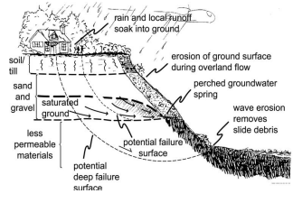

# CFD++ Idea

<<<<<<< HEAD

We will try to build a system for fast and reliable information dissemination to spread awareness among the people that in turn might save a lot of lives.

There are various established governments, around the world, that are working on weather monitoring and disaster prediction and most of the time they are able to predict the occurrence of one correctly but due to non-efficient early warning systems, these predictions are not able to perform as good as they should. In case of any such emergency, there might be no power and/or cellular coverage for users to consult the internet for the proper information and they have to rely on the resources at hand.

Most of the people have smartphones with them all the time and they are a great way to share information. We will try to make an application that will inform the users about any incoming emergency in accordance to the warning issued by the government. The app will also contain the information (guide) about the do’s and don’ts in these cases. It will help users to prepare for the worst case scenario. 

The app will also contain the possible safe spots and locations of relief camps stored offline. The user will be able to use this to navigate to the shelters and get help. All of his information will be updated regularly.

In any kind of emergency, careful use of resources is the key to survival. The smartphone with the user is one of the most valuable resource and thus conserving the power is an important issue. The app will come with an built-in battery saver that will close all the un-useful processes and will manage the processes so as to maximize the battery usage.

The all will also keep a record of user location and update it on the rescuer’s database (whenever the coverage is available) which will aid the rescuers to find the user easily.

For those who do not have a smartphone or lost one and can’t contact the rescuers and/or relatives, we will make a facial recognition system that will help find people who are lost and can’t get themselves identified. This will, obviously, work when there is data coverage.

## Key features (for users):
- Fast early warning dissemination of warnings issued by government departments.
- Guide to prepare for the emergency.
- Various threat levels (depending on the information provided by agencies).
- How to get help, locations of various relief camps and how to get there (offline navigation)
- Phone battery saver feature, because power is a key component in such cases of emergency.
- Update the location of the user on the relief database so that rescuers can easily find the users.
- Facial Recognition to identify lost users.

## Key features (for rescuers):
- Identification of hot zones, areas which are most affected
- Population density in affected areas so that rescue teams can prioritize their tasks.
- Management of resources in the refief shelters.
=======
## Landslide prediction

### Problem identification

Natural disasters like landslides, avalanches, floods and debris flows can result in enormous property damage and human casualties in mountainous regions. Therefore, efforts to measure and to monitor potential landslides are essential to ensure human safety and to protect civil infrastructure. To observe the behavior of slopes, monitoring systems have been installed or manual inspections by human experts have been conducted. Land Slide monitoring is based on geotechnical instrumentations using. However, cablebased systems are costly, require continuous maintenance. To overcome these limitations, wireless sensor networks and Internet of things are a viable alternative technology. 

The diagram shows what the causes of landslide are and how it affects to the different level of ground. These are explained below.

Factors Influencing Landslide Risk --
- Slope
- bedrock
- Surface water
- Earthquakes

### Solution
The landslide monitoring system automatically calculates the inverse velocity, and determines whether and when landslides can be expected. The system is composed of two subsystems, a wireless sensor network and a server system.

In each node various sensors are used. Such as:
 Accelerometer sensor
 Soil moisture sensor
 Temperature sensor
 Vibration sensor

The data send by these devices will be used by azure iot hub and edge platform for detecting sudden rise. If sensors cross the threshold value, alert system is activated. Alert system is in different form. Big buzzers are activated in the land slide area. There is an advanced alert system using SMS, email and IoT application. Azure maps will highlight the affected areas.

For deploying the system we would be working under one of our Professor Satessh kumar Pedoju.

## Reference
- http://ieeexplore.ieee.org/iel7/7361/4427201/07488208.pdf?arnumber=7488208
- http://troindia.in/journal/ijcesr/vol5iss4part4/20-23.pdf
- https://www.onlinejournal.in/IJIRV3I4/164.pdf
- https://pdfs.semanticscholar.org/5ef0/fd9b608159fc4fe637e84379a60694dbd5f1.pdf
>>>>>>> landslide predictor
