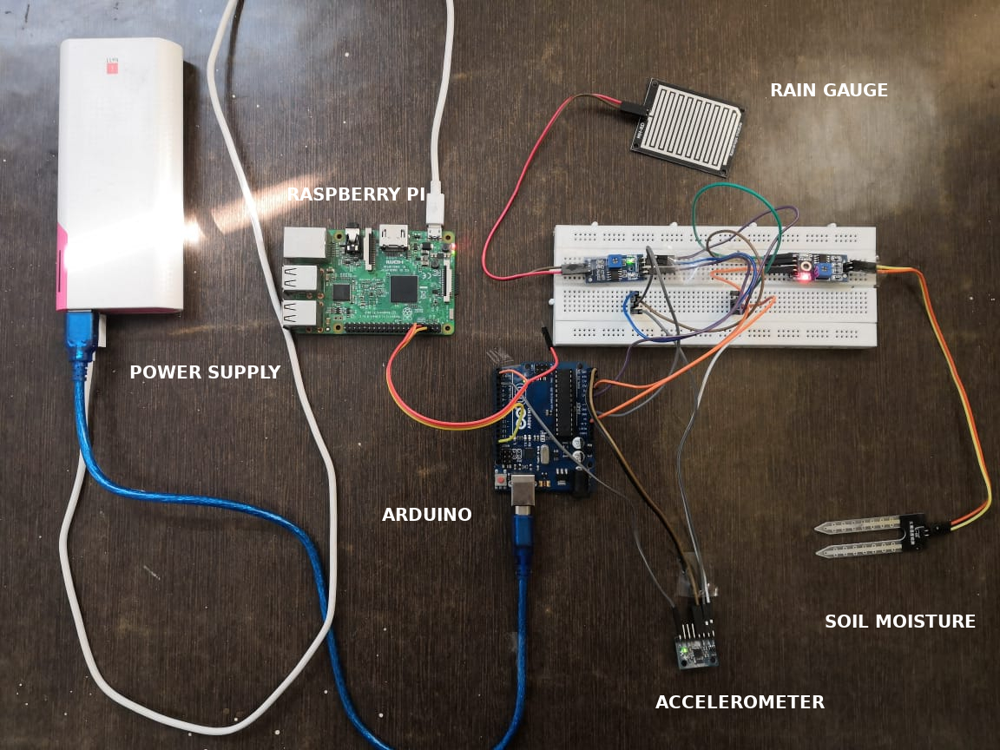

# CFD++ Idea

## Landslide detection and early warning system

## Problem identification

Natural disasters like landslides, avalanches, floods and debris flows can result in enormous property damage and human casualties in mountainous regions. Therefore, efforts to measure and to monitor potential landslides are essential to ensure human safety and to protect civil infrastructure. To observe the behavior of slopes, monitoring systems have been installed or manual inspections by human experts have been conducted. Land Slide monitoring is based on geotechnical instrumentations using. However, cablebased systems are costly, require continuous maintenance. To overcome these limitations, wireless sensor networks and Internet of things are a viable alternative technology. 

## Solution

Landslide every year causes a massive loss of life and properties. To tackle this problem, our government is investing a lot in early detection system. Such as government with help of IIT Roorkee faculty has installed sensors in the landslide prone areas of uttarakhand. But the cost of each sensor is around 84,000 and maintenance cost per sensor is 16,000 each year. So, through this cfd++ project we are proposing a cost effective iot solution, where each node has three sensors -- rain gauge, soil moisture and accelerometer, that are connected to arduino and the total cost of each node is around 1000 rupees. So, these nodes can be installed in large quantity for monitoring areas and a clusters of 10 nodes would be communicating with a central raspberry pi which is running a service for sending the data to IOT Hub, that in turn routes the payload to azure function for further processing. The serverless function has a job of calculating riskFactorm sending alert notification and saving data in cosmoDB for further analysis.

Now, for delivering analytical report and warning to monitoring agency and users we have a rest api which provides real time data from the sensors. We also have a dashbroad which can be used by government for surveiling regions and a app powered  by our infrastructure for getting notifications about the same.   

